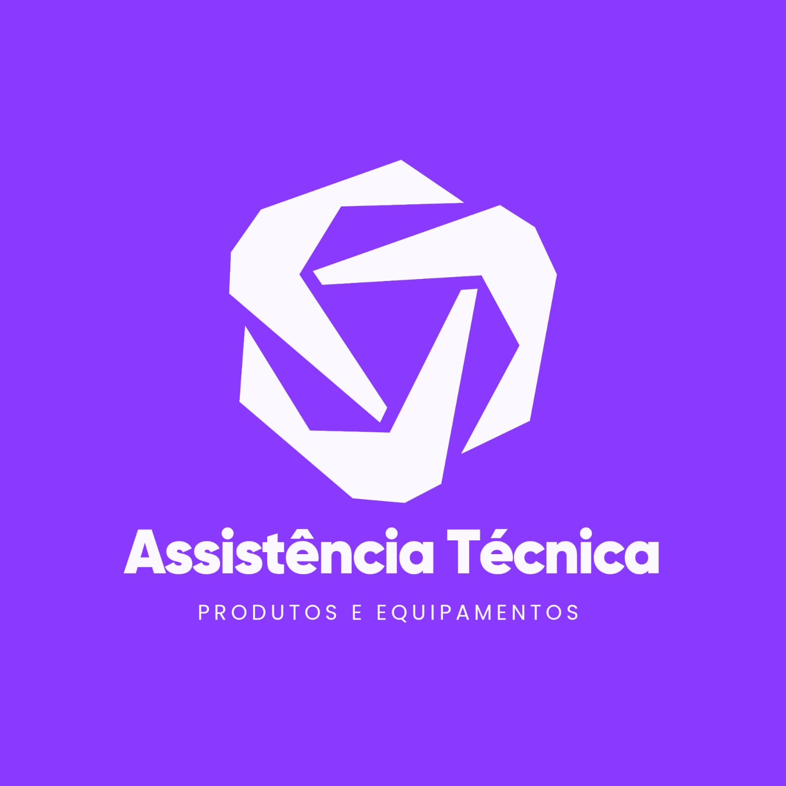

<h1 align="center">Sistema de Gerenciamento de Assistência Técnica</h1>

  

  <em>Este projeto consiste em um software completo para a gestão de uma assistência técnica de produtos e equipamentos. Desenvolvido como projeto final da disciplina de Linguagem de Programação (Java) na Universidade Federal da Paraíba (UFPB).</em>

---

### 🎯 | Objetivo
O objetivo principal foi aplicar os conceitos fundamentais de Java e POO (Herança, Polimorfismo, Encapsulamento e Abstração) para resolver um problema real de logística e controle. O sistema busca automatizar o fluxo de entrada de equipamentos, diagnóstico, orçamento e entrega final ao cliente, garantindo organização e rastreabilidade de dados, e usando Arquivos pra guardar os "Logs" do programa.

---

### 👥 | Desenvolvimento
O projeto foi realizado em colaboração mútua (em grupo), simulando um ambiente de desenvolvimento real onde a divisão de tarefas, controle de versões e integração de código foram essenciais para o sucesso da entrega.

---

### 💻 | Principais Funcionalidades do Sistema
  - **Cadastro de Clientes e Equipamentos:** Registro detalhado para facilitar o contato e histórico.
  - **Gestão de Ordens de Serviço:** Controle total desde a abertura até a conclusão do reparo.
  - **Interface:** Desenvolvida com foco em usabilidade para o técnico e o administrador.

---

### ⚙️ | Tecnologias Utilizadas no Projeto
  - **Linguagem:** 
  - **Versão do Java:** 25
  - **Programa usado no Desenvolvimento:** IntelliJ
